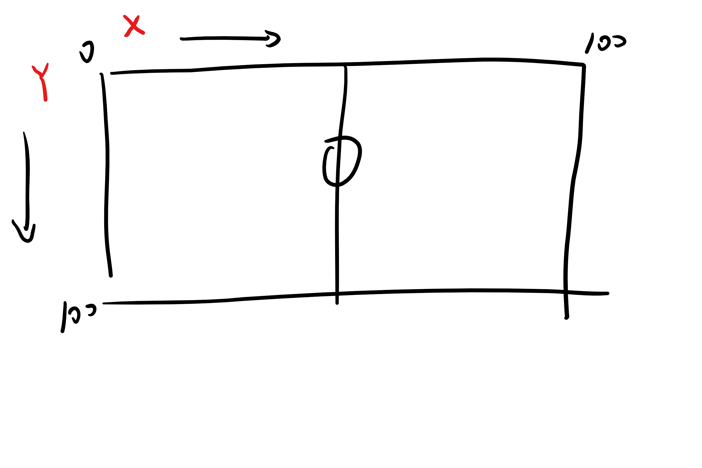
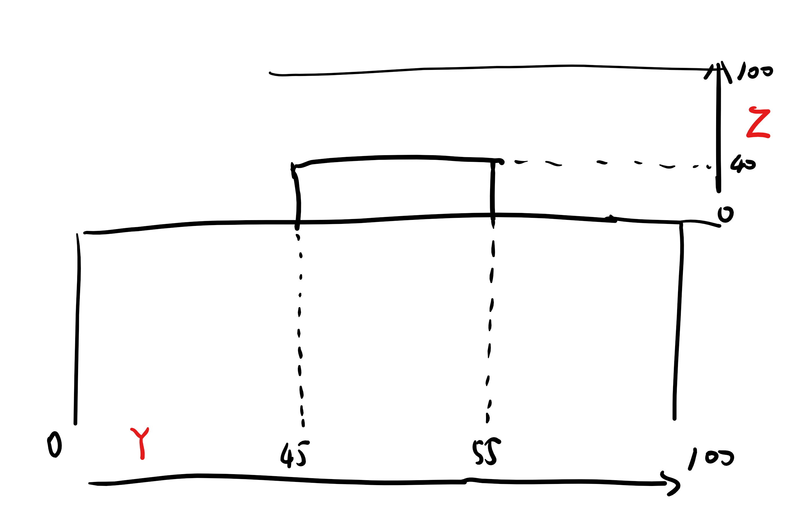

# 使用说明

## 动作细节
### 一个动作可能会有多个动作细节
## Q_PASS_END_X, 
## Q_PASS_END_Y 
### "落点横坐标", "落点纵坐标"
    1.只有传球的落点在禁区内时才需要记录
    2.坐标系为球场 范围[0-100]

## Q_SHOT_GOAL_MOUTH_Y, 
## Q_SHOT_GOAL_MOUTH_Z
### "球门横坐标", "球门高坐标"
    1.对于Y坐标 球门宽度为[45-55] 范围[0-100]
    2.对于Z坐标 球门高度为40, 请以球门为参照物估计球的落点 范围[0-100]

## Q_SHOT_BLOCKED_X, 
## Q_SHOT_BLOCKED_Y
### "遇阻横坐标", "遇阻纵坐标"
    1.当动作为 E_SHOT_SAVED ("射门：被救") 且射门被守门员或防守球员拦截时

## （注意） 
当动作为E_SHOT_SAVED ("射门：被救")时，动作细节也有可能为Q_SHOT_GOAL_MOUTH_Y Z 而不是Q_SHOT_BLOCKED_X Y 具体要视射门是被防守球员/守门员拦截，还是被守门员扑出

即E_SHOT_SAVED并且被拦截，则为Q_SHOT_BLOCKED

E_SHOT_SAVED并且被守门员扑出，则为Q_SHOT_GOAL_MOUTH